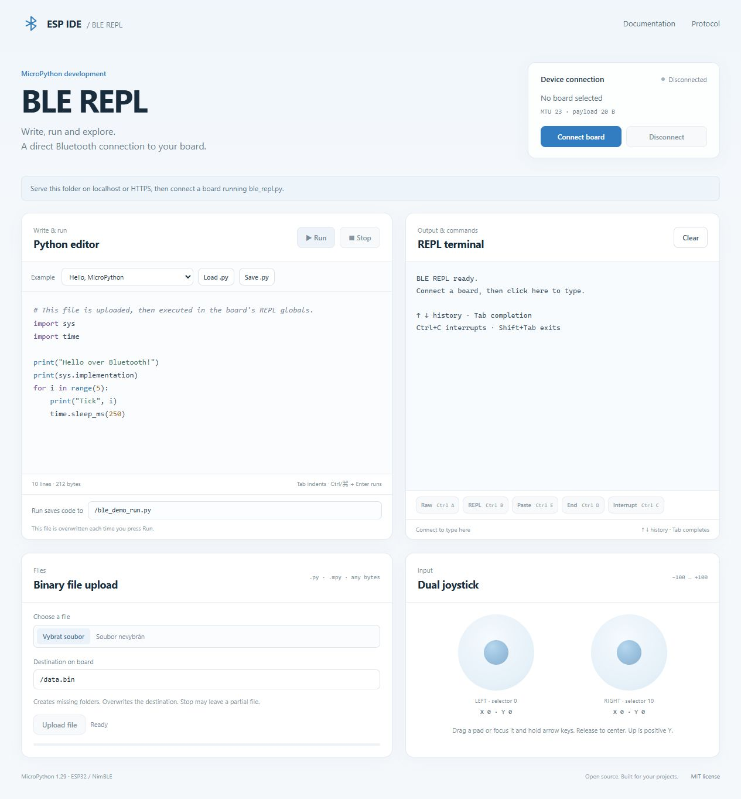

# MicroPython BLE REPL + binary upload + joystick

A small ESP32/NimBLE transport for **MicroPython 1.29**, with a fully commented,
self-contained Web Bluetooth demo. Write Python in your browser, run it on your
board, send binary files, and control two joysticks over one BLE connection.

[Česky / Czech](README.cs.md) · [Wire protocol](PROTOCOL.md) · [Verification](TESTING.md) · [MIT license](LICENSE)

**[Open the live demo](https://mispacek.github.io/MicroPython-BLE-REPL-binary-file-upload-joystick-WEB-demo/)** — hosted on GitHub Pages over HTTPS; no local server required.

## What is included

- **Interactive BLE REPL:** type directly in the terminal; cursor editing, history,
  Tab completion, paste/raw modes and Ctrl+C over Nordic UART Service.
- **Python editor:** syntax colors, four-space Tab indentation, local `.py` load/save, Run/Stop.
- **Binary upload:** `.py`, `.mpy`, images and arbitrary bytes; missing parent folders are created.
- **Dual joystick:** signed Lx/Ly/Rx/Ry, legacy `Joystick` API, mouse/touch/arrow-key controls.
- **Protocol client:** one GATT write lane, MTU-aware chunks, ACK windows, bounded retries,
  STATUS recovery after lost ACKs and cancellation before returning to the REPL.
- **Firmware diagnostics:** actual negotiated MTU, queue/drop counters, file state and GC memory.

The web page uses local, pinned MIT copies of xterm.js 6.0.0 and FitAddon 0.11.0.
No npm installation, remote fonts, CDN assets or framework are required to run it.
It is also an integration example: `web/ble-client.js` contains the transport,
`web/terminal.js` the commented terminal integration, `web/app.js` the UI, and
`web/editor.js` the lightweight display lexer. [Vendor details](web/vendor/README.md).

## 1. Start the driver on your board

Use an ESP32 with MicroPython 1.29 built with BLE/NimBLE, `micropython.RingIO`,
native emitter support and soft `machine.Timer` callbacks. Real-device validation
in this project covers ESP32-C3; other ESP32 models need their own device checks.

Upload `firmware/ble_repl.py` to the board as `/ble_repl.py` using USB/Thonny/mpremote.
`firmware/bletime.py` is optional compatibility support for old `bletime` imports;
the new driver itself uses native `utime` and does not patch it.

Run this once in the USB REPL:

```python
from ble_repl import start_ble_repl

ble = start_ble_repl(name="MPY-BLE-DEMO")
# The call returns immediately; the timer continues pumping BLE in the background.
```

The name is **1–29 UTF-8 bytes**. ESP32 uses `slot=0`; it is the optional second
keyword. A running BLE instance or occupied dupterm slot is refused instead of
silently replacing another owner's radio/terminal.

For deliberate autostart, add the same snippet to your own `main.py` after checking
your existing startup. No installer or test in this repository edits `boot.py` or
`main.py` automatically. USB REPL remains useful for installation and recovery.

Source `.py` installation is the portable example. If compiling `.mpy`, match
MicroPython version, MPY format and native architecture: ESP32-C3 is RISC-V;
ESP32/ESP32-S3 use Xtensa. Do not interchange compiled files.

## 2. Open the browser demo

Open the **[live demo](https://mispacek.github.io/MicroPython-BLE-REPL-binary-file-upload-joystick-WEB-demo/)**
and click **Connect board**. The driver must already be running on your ESP32.
The browser communicates directly with the board over BLE; GitHub only hosts the
static HTML, JavaScript and CSS.

For local development, run this from the repository directory:

```sh
python -B serve.py
```

Open **http://localhost:8087/web/** and click **Connect board**. Select your board.
Use a browser exposing Web Bluetooth, such as a supported Chrome/Edge installation.
Web Bluetooth requires a secure context and a user gesture to open the device
picker. Localhost is suitable for development; publish using HTTPS. Opening
`index.html` directly as `file://` is not the supported launch procedure.

GitHub Pages publishes **`main` / repository root**. The root page redirects to
**`/web/`**; all application assets are relative. `.nojekyll` keeps the published
files unchanged. Pushing updates to `main` automatically updates the site.
The Python server is only for local development, binds to
loopback, and serves with cache disabled; it is not a production hosting service.

See [Chrome's Web Bluetooth guide](https://developer.chrome.com/docs/capabilities/bluetooth)
for browser/API requirements. JavaScript cannot force the OS to negotiate MTU 247.

## 3. Use the REPL, editor and files

After connecting, click inside the terminal and type, for example:

```python
print("Hello from the real board")
import os; print(os.listdir('/'))
from ble_repl import get_active; print(get_active().stats())
```

Press **Enter** to execute. The browser forwards keys without local echo; the
board supplies the prompt, character echo, command history and completion.
xterm.js renders cursor movements and ANSI sequences even across BLE notifications.

| Key/control | Action |
| --- | --- |
| ↑ / ↓ | Previous / next command from MicroPython history |
| ← / →, Home / End, Backspace / Delete | Edit the current line on the board |
| Tab | Complete names using MicroPython |
| Ctrl+C / Interrupt | Interrupt Python or cancel the managed Run/upload |
| Ctrl+A / Raw, Ctrl+B / REPL | Enter raw mode / return to friendly mode |
| Ctrl+E / Paste, Ctrl+D / End | Begin paste mode / execute pasted or raw source |
| Ctrl/⌘+V | Paste clipboard text into the active mode |
| Ctrl/⌘+K / Clear | Clear local scrollback, keeping the current prompt/line |
| Shift+Tab | Move keyboard focus out of the terminal |

For multiline clipboard code, click **Paste**, paste the source with its original
indentation, then click **End**. Friendly REPL auto-indent can otherwise alter
pasted indentation. Ctrl+D in friendly mode performs a **soft reset** and can
disconnect a manually started driver. Use the editor for large programs.

Terminal input is paused during file transfer and REPL setup. Once an editor
program is executing, the same terminal accepts answers for Python `input()`.
REPL mode controls are blocked during managed Run; Ctrl+C remains available.

**Run** encodes the editor as UTF-8, uploads it to the visible destination
(`/ble_demo_run.py` by default), enters raw REPL and executes a small wrapper.
The source file persists on the board. Code executes in the REPL globals;
imports and your variables persist until reset. Uploading first lets the editor
source exceed the 2048-byte REPL input ring; compilation still needs sufficient
board RAM. Stdout streams to the terminal; raw-REPL stderr is shown as well.
On completion the client returns to friendly REPL. **Ctrl/⌘+Enter** also runs.

**Stop** cancels the client operation. During upload it first sends protocol
CANCEL to close the partial target, then sends Ctrl+C and a friendly-REPL escape.
During execution it interrupts Python, leaving the BLE driver running. A script
can catch `KeyboardInterrupt`; native blocking code or disabled interrupt handling
may delay/prevent stopping. Disconnect is available independently.

**Upload file** reads `File.arrayBuffer()` and preserves every byte. Select a
destination such as `/lib/helper.py` or `/assets/image.bin`. Accepted headers open
the target in `wb`: **existing files are overwritten**, with no temporary copy or
rollback. Cancellation, disconnection or an error may leave a partial file.
The final file ACK follows close/sync; SUM8 detects frame errors and is not a
cryptographic checksum of the file. The hardware test additionally verifies SHA-256.

The highlighter is a small lexer for comments, strings, keywords, numbers and
builtins. It is display-only; it does not validate Python or fully parse f-string
expressions. The editor escapes pasted HTML; terminal output is parsed as terminal
text/ANSI by xterm.js, never inserted as application HTML.

## 4. Read the joystick in MicroPython

Start the driver first; run this example from the editor:

```python
from ble_repl import Joystick, joy_read
import time

left = Joystick(0)
right = Joystick(10)

try:
    while True:
        print("L:", left.get_joyX(), left.get_joyY(),
              "R:", right.get_joyX(), right.get_joyY())
        if left.joy_check(1):
            print("Left joystick points up")
        time.sleep_ms(250)
except KeyboardInterrupt:
    print("Stopped; BLE remains active")
```

Move the page's pads with mouse/touch, or focus one and hold arrow keys.
Positive Y is up. Packets contain four signed Int8 values **Lx, Ly, Rx, Ry**;
the demo clamps them to −100…100 and sends the latest state every 80 ms while held.
Release, pointer cancellation and loss of focus center the pads. Joystick sending
pauses during uploads. Firmware getters return zero after **3000 ms** without
fresh input, including a dropped connection.

| Python call | Meaning |
| --- | --- |
| `Joystick(10)` | Right pair; other selector values use the left pair. |
| `get_joyX()`, `get_joyY()` | Clamped axes, zero when stale. |
| `joy_check(1/2/3/4)` | Up/right/down/left beyond ±40. |
| `joy_check(5)` | Both axes are nonzero; this is **not a button press**. |
| `joy_read()` | `(shared_axes_list, age_ms)`; raw values are not stale-zeroed. |

`JOY_POS` is a shared mutable list; copy it if you need a snapshot. Read the
timestamp through `joy_read()` or `ble_repl.JOY_TS_MS`, since importing an integer
timestamp once with `from ... import` does not track later assignments.

## 5. Driver lifecycle and diagnostics

```python
from ble_repl import BLENUSRepl, get_active

# Alternative to the factory, after the previous driver has been closed:
ble = BLENUSRepl(name="MY-PROJECT")  # Construction alone does not advertise.
ble.start()
assert get_active() is ble
print(ble.stats())
print(ble.mem_usage())

# Call from USB when intentionally shutting down the transport:
# ble.close()  # Idempotent. BLE terminal disconnects.
# After successful close, create a new object to restart.
```

`stats()` and `mem_usage()` are foreground helpers which allocate dictionaries.
`preferred_mtu=247` is a preference. Check `negotiated_mtu`, `mtu_confirmed` and
`chunk` for the actual connection. MTU 247 allows 244-byte GATT payloads and
240-byte file data; MTU 23 uses 20-byte payloads and 16-byte file data.
`notify_errors` includes recovered transient failures. `fault` retains the last
historical fault after reconnect; use `connected`/`ready` to interpret current state.
`gc_free`/`gc_alloc` describe the whole VM, not the driver's exclusive footprint.

The transport uses fixed 2048-byte RX/TX rings, 4096-byte ingress, a soft 20 ms
timer, deferred file I/O, priority protocol replies and native Ctrl+C delivery via
dupterm notification. Full stdout queues drop new output and count it; the driver
disconnects on input overflow rather than executing a truncated command.

Aliases `IDEBLERepl` and `start_ble_repl_bletime` are preserved. Successful start
also registers `ble_repl_bletime` as an alias for old joystick imports. It does
not redirect old objects created before starting this module. It does not inject
application-specific globals such as `clear_stop()`.

## 6. Integrate the JavaScript client

Import the module on your own HTTPS/localhost page. Call connect from a click:

```html
<button id="connect">Connect</button>
<button id="run">Run</button>
<button id="stop">Stop</button>
<link rel="stylesheet" href="./web/vendor/xterm/css/xterm.css">
<link rel="stylesheet" href="./web/style.css">
<div id="terminal" role="region" aria-label="Interactive MicroPython terminal"></div>
<p id="message" role="status"></p>
<script type="module">
import { BleReplClient } from './web/ble-client.js';
import { createReplTerminal } from './web/terminal.js';
const ble = new BleReplClient();
const report = error => {
  if (error.name !== 'AbortError') document.querySelector('#message').textContent = error.message;
};
// send() receives individual keystrokes AND pasted text. Do not echo it locally.
const terminal = createReplTerminal(document.querySelector('#terminal'),
  data => ble.writeTerminal(data), report);
ble.on('text', terminal.write);
ble.on('stderr', terminal.write);
const updateInput = () => terminal.setWritable(ble.terminalReady);
ble.on('state', updateInput);
ble.on('terminalReady', updateInput); // raw execution has begun; input() is available.
document.querySelector('#connect').onclick = async () => {
  try {
    await ble.connect(); // Must originate from a user click for the device picker.
    await ble.resumeRepl(); // Synchronize once; this interrupts any existing code.
    terminal.focus();
  } catch (error) { report(error); }
};
document.querySelector('#run').onclick = () => ble.run('print(42)').catch(report);
document.querySelector('#stop').onclick = () => ble.stop().catch(report);
</script>
```

Additional calls after connection:

```javascript
await ble.command('print("REPL")');
// command() synchronizes first. Interactive keys use writeTerminal() instead:
await ble.writeTerminal('pri');
await ble.writeTerminal('\t'); // Let the board complete the name.
await ble.writeTerminal('\x03'); // Interrupt/clear the unfinished line.
await ble.upload('/assets/data.bin', new Uint8Array([0, 255, 128]), ({sent, total}) => {
  console.log(sent, total);
});
await ble.joystick([-50, 100, 0, 0]);
ble.disconnect();
```

Operations reject if busy; the caller must catch promises and update controls.
`run()` resolves when user code finishes; it intentionally has no execution timeout.
Stop rejects an active run/upload with `AbortError`. Events are `state`, `device`,
`config`, `text`, `stderr`, `terminalReady` and `notice`; `on()` returns an unsubscribe function.
`writeTerminal()` accepts UTF-8 text/control sequences with a bounded 4096-byte
queue, sends paced MTU-sized chunks and preserves key order. Pending input is
invalidated before upload, Run, Stop, REPL synchronization or a new connection.
Keep repeated joystick sends bounded as shown in `app.js`.

## Limits, security and tests

NUS exposes an interpreter and file writes to nearby BLE clients. This driver
does not add pairing, bonding or application authentication. Treat it as a
development transport; add an appropriate access policy before exposing a product.
Browser origin/device permission does not authenticate another BLE client to the board.

Uploads need fewer than 65,536 DATA packets and at most 16,777,215 bytes. At MTU 23,
the packet-count limit is tighter than the 24-bit size limit. Whole DATA frames
must arrive within 1 s; transfer inactivity expires after 10 s. Keep DATA size
stable during recovery and follow [PROTOCOL.md](PROTOCOL.md).

Run `npm test` for local client regressions (Node 18+; no `npm install` needed).
Read [TESTING.md](TESTING.md) for separate local, browser and physical-device evidence,
and the opt-in C3 test. Results are scoped to the recorded setup, not a guarantee
for every board, browser, radio environment or long-running application.

## License and references

This standalone package is **MIT**, including its driver copy, documentation and
web demo; retain [LICENSE](LICENSE) when redistributing. The copyright holder
explicitly authorized MIT publication of the new driver copy. The original ESP IDE
checkout and legacy driver are not included or relicensed here.

The terminal concept was inspired by
[Silicon Witchery's web-bluetooth-repl](https://github.com/siliconwitchery/web-bluetooth-repl)
([ISC license](https://github.com/siliconwitchery/web-bluetooth-repl/blob/main/LICENSE.md)).
No source, graphics or dependencies from that project are bundled. The client and
page in this repository were written separately for this driver's file/joystick protocol.
The terminal renderer and fit addon come from [xterm.js](https://xtermjs.org/)
under MIT; retain their [copyright notices](web/vendor/README.md).
API references: [MicroPython Bluetooth](https://docs.micropython.org/en/v1.29.0/library/bluetooth.html),
[RingIO/scheduler](https://docs.micropython.org/en/v1.29.0/library/micropython.html),
[dupterm](https://docs.micropython.org/en/v1.29.0/library/os.html#os.dupterm).

## Demo preview


